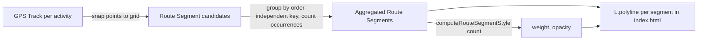

# Phase 1 Data Model: Route-Based Heatmap (Line Density Map)

## Entities

### GPS Track (existing, unchanged)

Already produced by the import pipeline (`gpsTracksByActivityId`, see
[src/zip-importer.js](../../src/zip-importer.js)). Not modified by this feature; listed here
only because Route Segments are derived from it.

| Field | Type | Notes |
|---|---|---|
| `activityId` | string | Map key; existing. |
| `sport` | `'Run' \| 'Bike' \| 'Swim'` | Existing, normalized sport (Constitution IV). |
| `points` | `Array<[lat, lon]>` | Existing downsampled GPS point sequence for the activity. |

### Route Segment (new, derived/in-memory only)

Computed on each render from `gpsTracksByActivityId`; never persisted or serialized.

| Field | Type | Notes |
|---|---|---|
| `cellA` | string | Grid-cell key (rounded lat/lon at ~15 m resolution) for one endpoint. |
| `cellB` | string | Grid-cell key for the other endpoint. |
| `key` | string | Order-independent identity, e.g. `[cellA, cellB].sort().join('\|')`, so A→B and B→A count as the same segment (satisfies FR-009). |
| `coords` | `[[number, number], [number, number]]` | Representative lat/lon pair (segment endpoints) used to draw the `L.polyline`. |
| `count` | number | Number of activities (within the active sport filter) that traversed this segment; drives thickness/opacity (FR-002, FR-005). |

**Validation / derivation rules**:

- A segment is only created between two *consecutive* points within the same activity's
  track (no segments are synthesized across unrelated activities or non-adjacent points).
- `count` MUST be recomputed whenever the sport filter changes (FR-006); segments not
  present in the filtered activity set MUST NOT be shown (no stale routes, per SC-004).
- Activities without GPS track data are excluded before segment derivation (FR-008),
  consistent with existing `hasGpsData`-guarded behavior.
- `count` has no enforced upper bound in the data itself; the **rendered** `weight`/`opacity`
  derived from `count` MUST be clamped (FR-003) — the cap is a rendering concern, not a data
  concern.

### Route Style Scale (new, pure function output — not a stored entity)

A derived mapping, not a stored object, but documented here since it's part of the feature's
data flow: `(count: number) => { weight: number, opacity: number }`, implementing the
non-linear scale from [research.md](./research.md) Decision 3, with a legible minimum (for
`count = 1`) and a hard-capped maximum.

## Function Signatures (internal "contract" — see plan.md rationale for skipping `contracts/`)

All additions live in [src/heatmap-utils.js](../../src/heatmap-utils.js), following the
existing CommonJS + `window.heatmapUtils` bridge pattern:

```js
// Snap a raw [lat, lon] point to a grid cell key at ~15m resolution.
function snapToGridCell(lat, lon) -> string

// Build { [segmentKey]: RouteSegment } from gpsTracksByActivityId, optionally filtered by sport.
function buildRouteSegments(gpsTracksByActivityId, options = { sportFilter }) -> Object<string, RouteSegment>

// Map a visit-frequency count to a clamped { weight, opacity } style pair.
function computeRouteSegmentStyle(count, options = { minWeight, maxWeight, minOpacity, maxOpacity }) -> { weight: number, opacity: number }
```

These functions are pure and DOM-free (Constitution II), enabling direct Jest coverage in
`__tests__/heatmap-utils.test.js` without a jsdom environment (Constitution III).

## Relationships



No state transitions apply — all derived data is recomputed per render (sport filter
change, tab open) rather than mutated over time.
