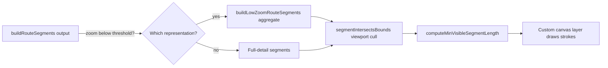

# Phase 1 Data Model: Heatmap Navigation Performance at Scale

## Entities

### Route Segment (existing, from `specs/001-route-line-heatmap`, unchanged shape)

Produced by `buildRouteSegments()` in [src/heatmap-utils.js](../../src/heatmap-utils.js).
Not restructured by this feature — this feature changes how many of these get drawn per
frame and how they're drawn, not what they represent or how frequency is counted.

| Field | Type | Notes |
|---|---|---|
| `cellA` / `cellB` | string | Existing grid-cell keys. |
| `key` | string | Existing order-independent identity. |
| `coords` | `[[number, number], [number, number]]` | Existing endpoint lat/lon pair. |
| `count` | number | Existing visit-frequency count; never altered by this feature. |

### Viewport Bounds (new, derived/in-memory only)

The map's current visible geographic bounds, used for culling. Not a stored entity — read
from Leaflet's `map.getBounds()` at redraw time, represented as a plain
`[[minLat, minLon], [maxLat, maxLon]]` pair for the pure intersection-test function below.

### Aggregated (Low-Zoom) Route Segment (new, derived/in-memory only)

Only computed when the current zoom is below a configured threshold. A coarser-grid
version of Route Segment, used purely for rendering at low zoom.

| Field | Type | Notes |
|---|---|---|
| `coords` | `[[number, number], [number, number]]` | Endpoint pair on the coarser grid. |
| `count` | number | Sum of the underlying Route Segments' counts that were merged into this coarser segment (for consistent thickness/opacity styling at low zoom; does not replace or alter the original per-segment counts used elsewhere). |

**Validation / derivation rules**:

- Aggregation MUST be purely a rendering-time concern: the original `buildRouteSegments()`
  output (and thus frequency accuracy, spec FR-004) is never mutated or replaced by the
  aggregated representation.
- A segment (aggregated or not) that would intersect the current viewport bounds MUST NOT be
  skipped by culling merely because it is far from the viewport center — intersection with
  the padded viewport bounds is the only culling criterion (spec: must not hide isolated
  activities, FR-003/SC-004).
- A segment whose rendered length would fall below the configured minimum-visible-length
  MUST still be drawn with at least that minimum length (e.g., as a short dash/dot), not
  skipped outright, to preserve visibility of isolated single-visit activities at world zoom.

## Function Signatures (internal "contract" — see plan.md rationale for skipping `contracts/`)

New pure, DOM-free additions to
[src/heatmap-utils.js](../../src/heatmap-utils.js):

```js
// Does a segment's bounding box intersect the given (padded) viewport bounds?
function segmentIntersectsBounds(segment, viewportBounds, paddingDegrees = 0) -> boolean

// Aggregate route segments onto a coarser grid (larger cell size than the 15m default)
// for low-zoom rendering only; sums counts of merged segments. Pure, does not mutate input.
function buildLowZoomRouteSegments(segments, options = { cellMeters }) -> Object<string, RouteSegment>

// Given a segment's true pixel length at the current zoom/projection, decide the pixel
// length it should actually be drawn at (never below a configured minimum).
function computeMinVisibleSegmentLength(trueLengthPx, options = { minLengthPx }) -> number
```

DOM/Canvas-dependent additions in `index.html` (not unit-testable, verified via
[quickstart.md](./quickstart.md)):

- A custom Leaflet layer class (extends `L.Layer`) that owns one `<canvas>` element, listens
  for `moveend`/`zoomend`/`resize`, and on each redraw: gets the current viewport bounds,
  filters segments via `segmentIntersectsBounds`, chooses full-detail vs
  `buildLowZoomRouteSegments` output based on current zoom, and draws each with the Canvas
  2D API using `map.latLngToContainerPoint()` plus `computeMinVisibleSegmentLength` to avoid
  fully-invisible strokes.
- `renderHeatmap()` in `index.html` is updated to construct/update this layer instead of
  creating one `L.polyline` per segment.

## Relationships



No state transitions apply — everything here is recomputed per redraw
(`moveend`/`zoomend`), matching the existing per-render recomputation pattern from
`specs/001-route-line-heatmap`.
