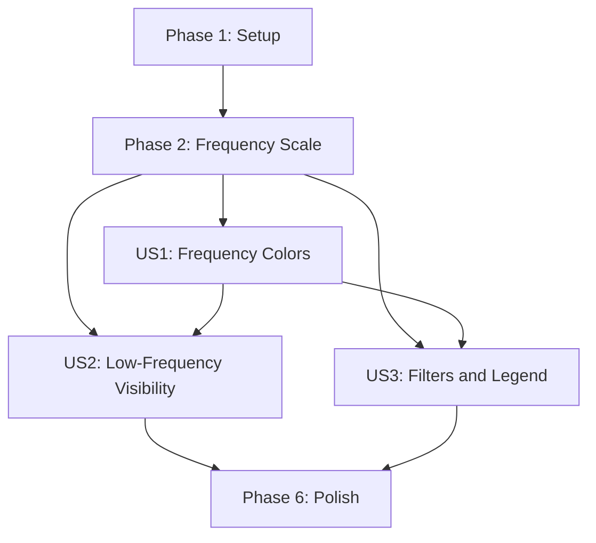

---

description: "Task list for logarithmic heatmap color implementation"
---

# Tasks: Logarithmic Heatmap Colors

**Input**: Design documents from `/specs/003-logarithmic-heatmap-colors/`

**Prerequisites**: [plan.md](./plan.md), [spec.md](./spec.md), [research.md](./research.md), [data-model.md](./data-model.md), [contracts/heatmap-color-ui.md](./contracts/heatmap-color-ui.md), [quickstart.md](./quickstart.md)

**Tests**: Included because Constitution Principle III requires Jest coverage for reusable
logic and focused validation for dashboard behavior.

**Organization**: Tasks are grouped by user story so each visual increment can be completed
and validated independently.

## Format: `[ID] [P?] [Story] Description`

- **[P]**: Can run in parallel because it touches a different file and has no dependency on
  an incomplete task
- **[Story]**: Maps the task to User Story 1, 2, or 3 from [spec.md](./spec.md)
- Every task names the exact file it changes or validates

## Path Conventions

- `src/heatmap-utils.js`: pure, DOM-free CommonJS and browser-global helpers
- `__tests__/heatmap-utils.test.js`: Jest tests in the Node environment
- `index.html`: Leaflet/Canvas rendering, preview, legend markup, and filter integration
- `README.md`: user-facing feature summary

## Phase 1: Setup

**Purpose**: Establish a passing baseline without adding dependencies or project structure.

- [X] T001 Run `npm test -- --runTestsByPath __tests__/heatmap-utils.test.js __tests__/index-script-syntax.test.js` from the repository root and record any pre-existing failures before changing `src/heatmap-utils.js` or `index.html`

---

## Phase 2: Foundational (Blocking Prerequisites)

**Purpose**: Provide the stable filtered-domain scale used by every user story.

**CRITICAL**: No user story implementation starts until this phase passes its focused tests.

- [X] T002 Write failing Jest tests for `computeRouteFrequencyScale(segments)` and `normalizeRouteFrequency(count, scale)` in `__tests__/heatmap-utils.test.js`, covering `1/10/100/1000 -> 0/~0.333/~0.667/1`, clamping, no input mutation, and these data-model constraints verbatim: "Non-finite, zero, negative, missing, and non-numeric counts do not participate", "No valid counts produces `null` rather than an invented domain", and "One valid value or several equal values produce `hasRange: false`, with minimum and maximum equal and no red classification"
- [X] T003 Implement `computeRouteFrequencyScale(segments)` and `normalizeRouteFrequency(count, scale)` in `src/heatmap-utils.js`, including `minCount`, `maxCount`, `logMin`, `logMax`, `extremeStartCount`, and `hasRange`; export both through `module.exports` and `window.heatmapUtils`, then make T002 pass

**Checkpoint**: A deterministic logarithmic scale exists for any filtered route collection.

---

## Phase 3: User Story 1 - Read route frequency from color (Priority: P1) MVP

**Goal**: Routes progress deterministically from light blue through dark blue to red in
frequency order, while existing thickness and opacity remain unchanged.

**Independent Test**: Render segments with counts `1`, `10`, `100`, and `1000`; verify four
ordered, distinguishable colors, equal counts receiving equal colors, and red appearing only
above normalized `0.9`.

### Tests for User Story 1

> Write these tests first and confirm they fail before implementation.

- [X] T004 [US1] Add failing Jest tests for `computeRouteSegmentColor(count, scale, options?)` in `__tests__/heatmap-utils.test.js`, asserting exact endpoint colors `#60A5FA`, `#1E3A8A`, and `#DC2626`, deterministic channel interpolation, equal colors for equal counts, blue-only results at and below normalized `0.9`, red introduction only above `0.9`, and the contract "Uses the default palette unless all three color stops are supplied through options"

### Implementation for User Story 1

- [X] T005 [US1] Implement dependency-free RGB parsing/interpolation and `computeRouteSegmentColor(count, scale, options?)` in `src/heatmap-utils.js` using light blue `#60A5FA` at `0`, dark blue `#1E3A8A` at `0.9`, and red `#DC2626` at `1`; export it through CommonJS and `window.heatmapUtils`, then make T004 pass
- [X] T006 [US1] Update `RouteCanvasLayer.setSegments()` and `_draw()` in `index.html` to derive one scale from the complete filtered segment set, cache a color for each full-detail segment when data changes, and use the cached color as `ctx.strokeStyle` while leaving `computeRouteSegmentStyle(segment.count)` unchanged
- [X] T007 [US1] Update `renderHeatmapPreviewMap()` in `index.html` to derive one scale for `buildDemoRouteSegments()` and color every preview polyline through `window.heatmapUtils.computeRouteSegmentColor` instead of the fixed orange `ROUTE_LINE_COLOR`
- [X] T008 [US1] Run the focused tests and perform the User Story 1 scenario from `specs/003-logarithmic-heatmap-colors/quickstart.md`, verifying counts `1/10/100/1000`, same-count determinism, and the blue-to-red threshold in both the full heatmap and preview

**Checkpoint**: User Story 1 independently delivers the requested ordered frequency palette.

---

## Phase 4: User Story 2 - Keep infrequent routes visible (Priority: P1)

**Goal**: One-off and low-frequency routes remain visible across thousand-fold frequency
ranges, including at low zoom, without aggregate sums inventing extreme red routes.

**Independent Test**: Display one-visit routes beside 10-, 100-, 502-, and 1,000-visit
routes, then cross the low-zoom threshold; all levels remain visible and only a genuinely
extreme source route introduces red.

### Tests for User Story 2

> Write these tests first and confirm they fail before implementation.

- [X] T009 [US2] Add failing edge-case tests in `__tests__/heatmap-utils.test.js` asserting that missing/invalid individual counts return the light-blue fallback without changing valid bounds, one or many equal counts remain light blue, and the `1/10/100/1000` sequence remains ordered and pairwise distinguishable
- [X] T010 [US2] Add failing low-zoom tests in `__tests__/heatmap-utils.test.js` for the `buildLowZoomRouteSegments()` constraint "`count` is the existing sum of source counts, used for weight and opacity" and "`colorCount` is the maximum valid source `count`, used only for color", including invalid source counts and no input mutation

### Implementation for User Story 2

- [X] T011 [US2] Extend `buildLowZoomRouteSegments()` in `src/heatmap-utils.js` to preserve summed `count` and add `colorCount` as the maximum finite positive source frequency per aggregate, without mutating source segments, then make T009-T010 pass
- [X] T012 [US2] Update the low-zoom cache construction and Canvas draw path in `index.html` to cache aggregate colors from `colorCount` against the full-detail filtered scale while continuing to pass summed `count` to `computeRouteSegmentStyle`, preserving viewport culling and `extendSegmentToMinLength`
- [X] T013 [US2] Run the focused tests and perform the visibility/navigation scenario in `specs/003-logarithmic-heatmap-colors/quickstart.md`, checking representative OSM streets, water, parks, world zoom, the existing zoom-10 transition, isolated one-off routes, and no artificial aggregate red

**Checkpoint**: User Story 2 independently proves logarithmic visibility and preserves the
feature-002 performance representation.

---

## Phase 5: User Story 3 - Understand and filter the scale consistently (Priority: P2)

**Goal**: A compact accessible guide explains the active scale and updates atomically with
All Sports, Run, Bike, and Swim selections.

**Independent Test**: Change among all sport filters using routes with different per-sport
frequencies; map colors and legend bounds update together, pan/zoom leaves them stable, and
empty/equal/error states show no misleading range.

### Tests for User Story 3

> Write this test first and confirm it fails before implementation.

- [X] T014 [US3] Add failing Jest tests for a pure `buildFrequencyScaleGuide(scale)` view-model helper in `__tests__/heatmap-utils.test.js`, asserting varied output with minimum, rounded-up `extremeStartCount`, maximum and accessible text; constant output with one blue value and no red range; and hidden output for a missing scale

### Implementation for User Story 3

- [X] T015 [US3] Implement `buildFrequencyScaleGuide(scale)` in `src/heatmap-utils.js` with the Scale Guide fields and display rules from `specs/003-logarithmic-heatmap-colors/data-model.md`, export it through CommonJS and `window.heatmapUtils`, then make T014 pass
- [X] T016 [P] [US3] Add the compact non-interactive `heatmapFrequencyLegend` markup and stable responsive dimensions to the lower-left of the map wrapper in `index.html`, including gradient, constant-value, numeric-label, and accessible-label targets without overlapping Leaflet attribution or controls
- [X] T017 [US3] Implement legend rendering in `index.html` from `buildFrequencyScaleGuide(scale)` and call it from the same `renderHeatmap()` update as `RouteCanvasLayer.setSegments()`; hide and clear the legend for no GPS data, an empty sport result, or Leaflet load failure, and keep it unchanged during pan/zoom
- [X] T018 [US3] Run focused tests and perform all filter, constant-domain, empty-state, load-error, accessibility, mobile, and desktop checks in `specs/003-logarithmic-heatmap-colors/quickstart.md`, confirming zero stale colors or legend values after each filter change

**Checkpoint**: All three stories work together and the adaptive colors remain understandable.

---

## Phase 6: Polish & Cross-Cutting Concerns

**Purpose**: Remove obsolete styling, document the user-visible behavior, and complete all
regression gates.

- [X] T019 Remove the obsolete fixed `ROUTE_LINE_COLOR` constant and any dead fixed-orange heatmap paths in `index.html`, then run `__tests__/index-script-syntax.test.js` to catch inline-script regressions
- [X] T020 [P] Update the heatmap description in `README.md` to mention logarithmic light-blue-to-red frequency colors and the legend without claiming that local file processing eliminates existing map/API network requests
- [X] T021 Run the complete `npm test` suite and every scenario in `specs/003-logarithmic-heatmap-colors/quickstart.md`, confirming route geometry, frequency thickness, sport filters, empty states, world-view visibility, preview rendering, responsive legend layout, and large-dataset pan/zoom remain regression-free
- [X] T022 Add and fix a large-segment regression test in `__tests__/heatmap-utils.test.js` and `src/heatmap-utils.js` so `computeRouteFrequencyScale()` handles hundreds of thousands of segments without spreading counts into function arguments or throwing `RangeError`

---

## Dependencies & Execution Order

### Phase Dependencies

- **Setup (Phase 1)**: No dependencies; establishes the baseline.
- **Foundational (Phase 2)**: Depends on T001 and blocks all story implementation.
- **User Story 1 (Phase 3)**: Depends on T003; delivers the MVP color encoding.
- **User Story 2 (Phase 4)**: Depends on T005 for color calculation; T012 also depends on
  T006's Canvas cache. Its pure tests and aggregation work can begin once Phase 2 is complete.
- **User Story 3 (Phase 5)**: Depends on T003 for scale metadata; legend markup can proceed
  independently, while T017 integrates with T006's layer update.
- **Polish (Phase 6)**: Depends on all selected user stories.

### User Story Dependency Graph



### User Story Dependencies

- **User Story 1 (P1)**: Requires only the foundational scale and independently delivers
  ordered color encoding in the full map and preview.
- **User Story 2 (P1)**: Reuses US1's color helper and Canvas cache, then independently proves
  visibility and correct low-zoom semantics.
- **User Story 3 (P2)**: Reuses the foundational scale and US1 integration, then independently
  adds interpretation and filter-state consistency.

### Within Each User Story

- Write the listed tests and confirm failure before implementation.
- Implement pure helpers before wiring them into `index.html`.
- Complete focused automated tests before manual browser validation.
- Do not begin final polish until all selected story checkpoints pass.

### Parallel Opportunities

- After T003, T004 (US1 tests), T010 (US2 aggregate tests after T009), and T016 (US3 markup)
  affect separate concerns; T004 and T016 can run in parallel because they touch different
  files.
- After T005, T011 (`src/heatmap-utils.js`) and T016 (`index.html`) can run in parallel.
- T020 (`README.md`) can run in parallel with final test preparation after behavior is stable.

## Parallel Example: User Story 1

User Story 1 is intentionally sequential within its own files: T004 -> T005 -> T006 -> T007
-> T008. In a multi-story implementation, launch T004 alongside US3's independent markup:

```text
Task T004: Add color-contract tests in __tests__/heatmap-utils.test.js
Task T016: Add legend markup in index.html
```

## Parallel Example: User Story 2

After T005, prepare low-zoom logic while the independent legend markup is built:

```text
Task T011: Add colorCount aggregation in src/heatmap-utils.js
Task T016: Add legend markup in index.html
```

T009-T013 remain sequential inside User Story 2 because they share test/source/integration
dependencies.

## Parallel Example: User Story 3

After the foundational scale exists, the pure guide tests and static markup can be prepared
in parallel:

```text
Task T014: Add buildFrequencyScaleGuide tests in __tests__/heatmap-utils.test.js
Task T016: Add heatmapFrequencyLegend markup in index.html
```

Complete T015 before T017 integrates the view model.

---

## Implementation Strategy

### MVP First (User Story 1 Only)

1. Complete T001-T003 for baseline and logarithmic scale.
2. Complete T004-T008 for the requested color progression.
3. Stop and validate User Story 1 independently.
4. Demonstrate the full heatmap and dashboard preview before extending low-zoom semantics.

### Incremental Delivery

1. Setup + Foundation: stable logarithmic domain with edge-case handling.
2. User Story 1: visible light-blue-to-dark-blue-to-red progression (MVP).
3. User Story 2: guaranteed low-frequency visibility and correct low-zoom aggregation.
4. User Story 3: scale guide and filter-consistent updates.
5. Polish: remove old styling, update documentation, run all regressions.

### Solo Developer Strategy

Implement sequentially in task order because `src/heatmap-utils.js`, its single Jest file,
and `index.html` are shared across stories. Use the listed parallel opportunities only when
separate contributors can coordinate the small number of shared files.

## Notes

- `[P]` marks only tasks that can proceed on separate files without an incomplete dependency.
- Every user-story task carries its `[US#]` traceability label.
- No new dependency, service, storage, tab, or tab-navigation change belongs in this feature.
- Use synthetic counts for automated tests and keep personal Strava exports untracked.