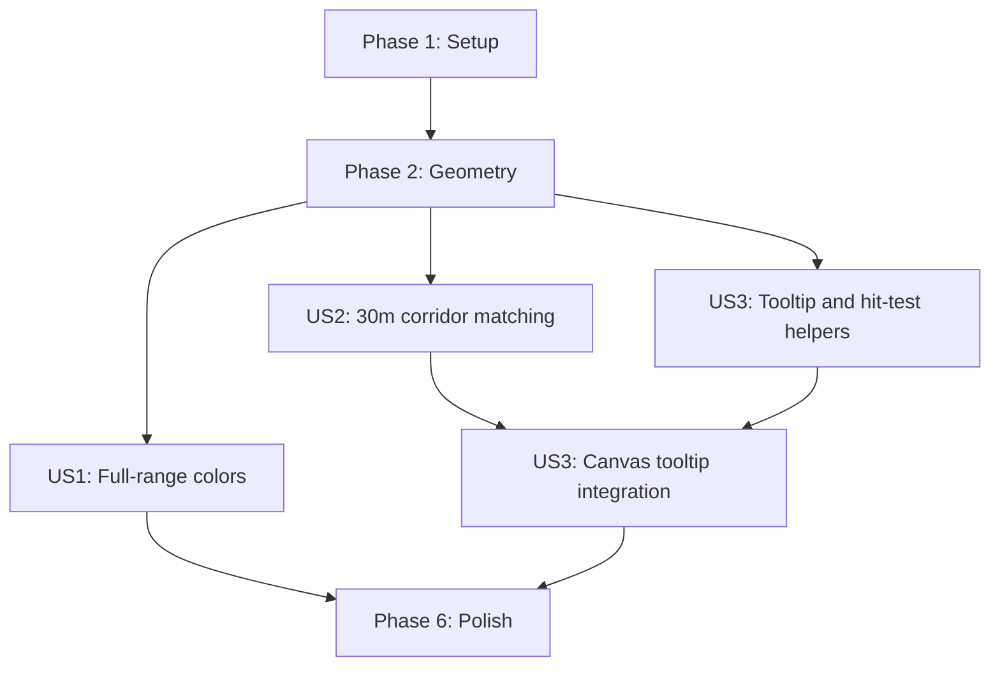

---

description: "Task list for heatmap frequency and activity details"
---

# Tasks: Heatmap Frequency and Activity Details

**Input**: Design documents from `/specs/004-heatmap-frequency-details/`

**Prerequisites**: [plan.md](./plan.md), [spec.md](./spec.md), [research.md](./research.md), [data-model.md](./data-model.md), [contracts/heatmap-hover-ui.md](./contracts/heatmap-hover-ui.md), [quickstart.md](./quickstart.md)

**Tests**: Included because Constitution Principle III requires focused Jest coverage for
reusable logic and executable validation for dashboard behavior.

**Organization**: Tasks are grouped by user story, with shared geometry primitives completed
first and tooltip work consuming the activity membership delivered by User Story 2.

## Format: `[ID] [P?] [Story] Description`

- **[P]**: Can run in parallel because it touches a different file and has no incomplete
  dependency
- **[Story]**: Maps to User Story 1, 2, or 3 from [spec.md](./spec.md)
- Every task names an exact file path

## Path Conventions

- `src/heatmap-utils.js`: pure matching, color, membership, sampling, formatting, and hit-test logic
- `__tests__/heatmap-utils.test.js`: Jest tests in the Node environment
- `index.html`: existing Leaflet/Canvas layer, legend, import state, and tooltip UI
- `README.md`: user-visible heatmap behavior

## Phase 1: Setup

**Purpose**: Record the current baseline before changing the established heatmap behavior.

- [X] T001 Run `npm test -- --runTestsByPath __tests__/heatmap-utils.test.js __tests__/index-script-syntax.test.js` from the repository root and record any pre-existing failures before editing `src/heatmap-utils.js` or `index.html`

---

## Phase 2: Foundational (Blocking Prerequisites)

**Purpose**: Add deterministic geometry primitives shared by corridor matching and Canvas hit testing.

**CRITICAL**: Complete this phase before any user story implementation.

- [X] T002 Write failing tests for distance, undirected heading, interpolated probe spacing, heading-difference, and point-to-segment distance helpers in `__tests__/heatmap-utils.test.js`, including reversed endpoints, invalid coordinates, zero-length segments, and exact 30-meter/30-degree boundaries
- [X] T003 Implement the tested pure geometry helpers in `src/heatmap-utils.js` without DOM APIs, export them through both `module.exports` and `window.heatmapUtils`, and make T002 pass

**Checkpoint**: Shared deterministic geometry calculations are available for matching and hover targeting.

---

## Phase 3: User Story 1 - See meaningful frequency colors (Priority: P1) MVP

**Goal**: Preserve logarithmic count normalization while using the entire light-blue-to-red
color range, including the exact visual midpoint.

**Independent Test**: Render minimum, geometric-midpoint, and maximum frequencies and verify
`#60A5FA`, `#9E6690`, and `#DC2626`, plus Low/Mid/High legend labels.

### Tests for User Story 1

> Write these tests first and confirm they fail before implementation.

- [X] T004 [US1] Replace the feature-003 upper-ten-percent color tests with failing full-range tests in `__tests__/heatmap-utils.test.js`: `computeRouteFrequencyScale()` exposes `midpointCount = exp((logMin + logMax) / 2)`, `computeRouteSegmentColor()` maps normalized 0/0.5/1 to `#60A5FA`/`#9E6690`/`#DC2626`, counts `1/10/100/1000` produce `#60A5FA`/`#897BB3`/`#B3506D`/`#DC2626`, and constant/invalid domains remain visible non-red

### Implementation for User Story 1

- [X] T005 [US1] Update `computeRouteFrequencyScale()`, `computeRouteSegmentColor()`, and `buildFrequencyScaleGuide()` in `src/heatmap-utils.js` to remove `extremeStartCount` and the 0.9 dark-blue stop, add `midpointCount`, interpolate directly between light blue and red, and return hidden/constant/min-mid-max guide models; preserve the existing large-segment no-spread calculation and make T004 pass
- [X] T006 [US1] Update the Heatmap legend gradient, Low/Mid/High labels, guide rendering, accessible text, and preview/full-map color use in `index.html`, removing all `Red from` and upper-ten-percent assumptions while keeping the scale stable during pan/zoom and recalculated on sport-filter changes
- [X] T007 [US1] Run the focused suites and complete quickstart sections 3 and 6 from `specs/004-heatmap-frequency-details/quickstart.md`, verifying full-range colors and filter-specific legend values in the full map and dashboard preview

**Checkpoint**: User Story 1 independently fixes the misleading almost-all-blue palette.

---

## Phase 4: User Story 2 - Group repeated routes despite GPS variation (Priority: P1)

**Goal**: Aggregate the same real route across realistic GPS offsets while retaining
deterministic geometry and auditable distinct activity membership.

**Independent Test**: Compare forward/reverse routes offset by 0, 20, 30, and 31 meters,
plus crossings, brief adjacency, divergence, and loops; only sustained 0-30 meter corridors
match, with at least 95% corresponding coverage.

### Tests for User Story 2

> Write these tests first and confirm they fail before implementation.

- [X] T008 [US2] Add failing corridor-matching tests in `__tests__/heatmap-utils.test.js` for probe spacing at most 30 meters, midpoint distance at most 30 meters, undirected heading difference at most 30 degrees, at least three consecutive corresponding probes (approximately 90 meters), reverse traversal, 31-meter separation, perpendicular crossing, brief parallel contact followed by divergence, deterministic output under shuffled activity insertion order, sport filtering, and repeated loops within one activity

### Implementation for User Story 2

- [X] T009 [US2] Implement transient track probing, 30-meter neighbor-cell candidate lookup, undirected heading comparison, continuity-run scoring, and deterministic candidate tie-breaking in `src/heatmap-utils.js`, retaining canonical geometry from the first activity in sorted activity-ID order
- [X] T010 [US2] Refactor `buildRouteSegments()` in `src/heatmap-utils.js` to use T009's corridor matcher and satisfy these data-model constraints verbatim: "`activityIds` is a sorted string array of distinct imported activity IDs only", "`count` MUST equal `activityIds.length`", and "A single activity ID occurs at most once in `activityIds` for any segment"; retain configurable sport filter, 30-meter tolerance, probe spacing, 90-meter continuity, and 30-degree heading options, then make T008 pass
- [X] T011 [US2] Add failing low-zoom membership tests in `__tests__/heatmap-utils.test.js` requiring `activityIds` to be the sorted distinct union of source segment IDs, `count` to equal that union length, `colorCount` to equal the maximum source detail count, unresolved/empty membership to remain safe, and source segments to remain unmodified
- [X] T012 [US2] Update `buildLowZoomRouteSegments()` in `src/heatmap-utils.js` to satisfy T011, replacing summed counts with distinct activity-ID unions while preserving representative geometry and `colorCount`, then make all matching and aggregation tests pass
- [X] T013 [US2] Run focused tests and complete quickstart sections 4 and 6 in `specs/004-heatmap-frequency-details/quickstart.md`, including the 95% correspondence target, crossing/divergence checks, world/detail zoom, every sport filter, count-membership equality, and comparison against an explicitly supplied large local dataset without committing it

**Checkpoint**: User Story 2 independently produces meaningful repeated-route counts and the
activity membership required by hover details.

---

## Phase 5: User Story 3 - Inspect activities behind a route (Priority: P2)

**Goal**: Resolve visible Canvas routes on mouse hover and show locally derived activity
details, listing all entries up to ten or one stable random sample of ten above that limit.

**Independent Test**: Hover segments with 1, 10, 11, unresolved, overlapping, and low-zoom
memberships; verify target choice, content, units, sample stability, lifecycle, and response
within 250 milliseconds.

### Tests for User Story 3

> Write these tests first and confirm they fail before implementation.

- [X] T014 [US3] Add failing tests for `buildActivitySummaryIndex()`, `sampleDistinct()`, and `buildActivityTooltipModel()` in `__tests__/heatmap-utils.test.js`, including duplicate IDs, injected deterministic randomness, 1/10/11 activities, exact `Random 10 of X activities` text, stable unique samples, unresolved-ID availability notes, and these field rules verbatim: missing name/date/sport use `Unknown activity`/`Unknown date`/`Unknown sport`, invalid distance/duration use `--`, Run/Bike distance uses kilometers, Swim distance uses meters, and duration uses `h:mm:ss` or `m:ss`
- [X] T015 [US3] Implement activity summary indexing, partial Fisher-Yates distinct sampling, sport-unit formatting, duration/date fallback formatting, and tooltip view-model construction in `src/heatmap-utils.js`, export all public helpers through CommonJS and `window.heatmapUtils`, and make T014 pass
- [X] T016 [US3] Add failing tests for `buildScreenSegmentIndex()` and `hitTestScreenSegmentIndex()` in `__tests__/heatmap-utils.test.js`, covering 32-pixel cells, padded multi-cell insertion, point-to-segment hit radius `max(lineWidth / 2 + 5px, 6px)`, cell boundaries, misses, zero-length strokes, and deterministic overlap ties by shortest distance, higher count, then lexical key
- [X] T017 [US3] Implement `buildScreenSegmentIndex()` and `hitTestScreenSegmentIndex()` in `src/heatmap-utils.js` so lookup visits only the pointer cell and immediate neighbors, exports through both module bridges, and makes T016 pass without scanning the full segment collection per hit
- [X] T018 [P] [US3] Add a non-interactive, `pointer-events: none` activity-tooltip overlay with bounded width, heading, availability note, and reusable activity-row targets inside the Heatmap map wrapper in `index.html`, ensuring it can be clamped away from map controls and Leaflet attribution
- [X] T019 [US3] Build and store the activity-summary index from `processedActivities` in `applyImportedDataset()` in `index.html`, clear stale tooltip state on dataset replacement, and pass only local imported summaries to hover rendering without any network request
- [X] T020 [US3] Extend `RouteCanvasLayer` in `index.html` to rebuild a screen-space index from only visible final strokes on each redraw, throttle map-container `mousemove` with `requestAnimationFrame`, resolve the deterministic nearest route through T017, and avoid per-segment Leaflet objects or full-list pointer scans
- [X] T021 [US3] Implement tooltip model caching and safe text-only rendering in `index.html`: keep one random sample while the same segment remains targeted, show all activities up to ten or exactly `Random 10 of X activities`, clamp position within the map, and close on pointer leave, target change, move/zoom start, sport-filter change, dataset replacement, and layer removal without cancelling map gestures
- [X] T022 [US3] Run focused tests and complete quickstart sections 5-7 in `specs/004-heatmap-frequency-details/quickstart.md`, validating detail/low-zoom tooltips, 1/10/11 activity cases, missing metadata, filter cleanup, edge clamping, touch navigation, sample stability, overlap tie-breaking, and hover appearance within 250 milliseconds on approximately 221,000 visible/detail segments

**Checkpoint**: All three stories work together and route frequencies are transparent and inspectable.

---

## Phase 6: Polish & Cross-Cutting Concerns

**Purpose**: Remove superseded behavior, document the interaction, and run complete regression gates.

- [X] T023 [P] Update the GPS heatmap section in `README.md` to describe full-range logarithmic frequency colors, 30-meter corridor aggregation, and local hover activity samples without claiming that the entire app makes no network requests
- [X] T024 Remove obsolete 15-meter exact-cell and upper-ten-percent color comments/constants/tests from `src/heatmap-utils.js`, `index.html`, and `__tests__/heatmap-utils.test.js`, then run `npm test -- --runTestsByPath __tests__/heatmap-utils.test.js __tests__/index-script-syntax.test.js`
- [X] T025 Run `npm test` and every scenario in `specs/004-heatmap-frequency-details/quickstart.md`, confirming all existing parsing, import, route visibility, low-zoom, sport-filter, empty-state, preview, map-navigation, privacy, and large-dataset guarantees remain regression-free

---

## Dependencies & Execution Order

### Phase Dependencies

- **Setup (Phase 1)**: No dependencies; establishes the test baseline.
- **Foundational (Phase 2)**: Depends on T001 and blocks story work.
- **User Story 1 (Phase 3)**: Depends on T003 and can deliver the color correction alone.
- **User Story 2 (Phase 4)**: Depends on T003 and supplies activity membership needed by US3.
- **User Story 3 (Phase 5)**: Pure activity-model and hit-index work can begin after T003,
  but Canvas tooltip integration T019-T022 depends on US2's `activityIds` contract.
- **Polish (Phase 6)**: Depends on all selected stories.

### User Story Dependency Graph



### User Story Dependencies

- **User Story 1 (P1)**: Independent after Foundation; delivers useful corrected colors as
  the smallest MVP.
- **User Story 2 (P1)**: Independent after Foundation; improves counts and exposes audited
  activity membership.
- **User Story 3 (P2)**: Its pure helper work is independent, but end-to-end tooltip behavior
  requires User Story 2's segment `activityIds`.

### Within Each User Story

- Write the listed tests and confirm they fail before implementation.
- Implement pure functions before `index.html` integration.
- Run focused tests immediately after each implementation slice.
- Complete the story's manual quickstart checkpoint before moving to final polish.

### Parallel Opportunities

- After T003, US1 color work and US2 matching work can proceed in parallel if contributors
  coordinate edits to `src/heatmap-utils.js` and its test file through separate commits.
- T014-T017 pure US3 helpers can proceed while US2 integration is being validated.
- T018 tooltip markup can run in parallel with T014-T017 because it touches only `index.html`.
- T023 README work can run in parallel after behavior and wording are stable.

## Parallel Example: User Story 1 and User Story 2

```text
Task T004: Add full-range color tests in __tests__/heatmap-utils.test.js
Task T008: Add 30-meter corridor tests in __tests__/heatmap-utils.test.js
```

These are logically parallel but modify the same test file; use separate commits or execute
sequentially for a solo implementation.

## Parallel Example: User Story 3

```text
Task T014: Add tooltip-model tests in __tests__/heatmap-utils.test.js
Task T018: Add tooltip overlay markup in index.html
```

After T015 and T017 pass, T019-T021 integrate the independently prepared model, index, and UI.

---

## Implementation Strategy

### MVP First (User Story 1 Only)

1. Complete T001-T003.
2. Complete T004-T007.
3. Stop and validate full-range frequency colors independently.
4. Demonstrate that the real dataset's highest-frequency route is red before changing matching.

### Incremental Delivery

1. Setup + Foundation: tested geometry primitives.
2. User Story 1: corrected logarithmic position and full color ramp.
3. User Story 2: 30-meter corridor matching and auditable activity membership.
4. User Story 3: efficient Canvas hover and local sampled activity details.
5. Polish: remove superseded assumptions, document behavior, run all regressions.

### Solo Developer Strategy

Follow task order because the reusable utilities and one Jest file are shared. T018 and T023
are the safest parallel work; otherwise preserve test-first checkpoints and validate each
story before extending the same Canvas layer.

## Notes

- `[P]` marks only work on separate files with no incomplete dependency.
- Every story task carries its `[US#]` traceability label.
- No external map-matching service, new dependency, service/API change, or tab change belongs
  in this feature.
- Use synthetic fixtures for tests and keep private Strava exports untracked.