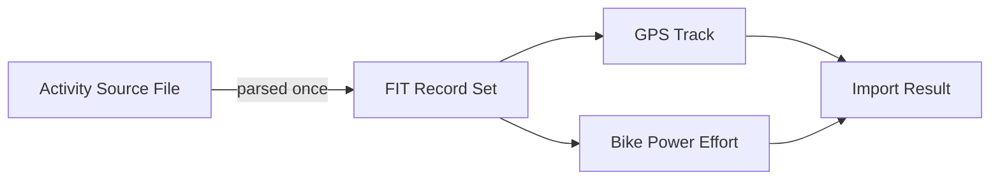

# Phase 1 Data Model: Faster Bike Power Import

This feature is an internal performance refactor of an existing import pipeline; it does
not introduce persisted entities or storage changes. The entities below are the
in-memory shapes already produced by `src/zip-importer.js` and consumed by `index.html`;
they are documented here to make explicit what must remain unchanged (FR-002/SC-003)
while the extraction path is restructured.

## Activity Source File (existing, unchanged shape)

Represents one activity's GPS/sensor file inside the imported ZIP.

| Field | Type | Notes |
|---|---|---|
| `filename` | string | Path inside the ZIP, e.g. `activities/123.fit.gz` |
| `activityId` | string | Matches the `Filename` → activity ID mapping from `activities.csv` |
| `ext` | `'gpx' \| 'fit'` | Determines which parser is used |
| `isGzipped` | boolean (derived) | True when `filename` ends in `.gz` |

**Change**: no field changes. What changes is that, for bike activities with `ext === 'fit'`,
the file's bytes are read/decompressed/parsed **once** per import instead of once for GPS
extraction and once for power extraction.

## FIT Record Set (existing, unchanged shape)

The intermediate `records` array returned by `parseFitRecords(FitParserCtor, bytes)` for
a single FIT file (already used identically by both `extractFitTrackpoints` and
`buildFitPowerEfforts` today).

| Field | Type | Notes |
|---|---|---|
| `records` | array of FIT record objects | As produced by `fit-file-parser` in `mode: 'list'` |

**Change**: none. This is the shared value that both derivations (trackpoints, power
efforts) will now read from a single parse call instead of two.

## GPS Track (existing, unchanged shape)

Produced by `extractGpsTracksFromZip`, keyed by `activityId`.

| Field | Type | Notes |
|---|---|---|
| `sport` | `'Run' \| 'Bike' \| 'Swim' \| null` | From `activitySportById` |
| `points` | `[lat, lon][]` | Simplified trackpoints (`simplifyTrackPoints`, ≤2000 points, 3m tolerance) |

**Change**: none — output must be byte-identical to today for the same input file
(FR-002/SC-003).

## Bike Power Effort (existing, unchanged shape)

Produced by `buildFitPowerEfforts(records)`, one array per bike `activityId`, feeding
`fitBestEffortsByActivityId` and ultimately power personal bests via
`power-pb-utils.js`.

| Field | Type | Notes |
|---|---|---|
| `targetSeconds` | number | One of `POWER_DURATIONS` (from `power-pb-utils.js`) |
| `watts` | number | Best rolling average power for that duration in this activity |
| *(other fields)* | — | Whatever `calculateRollingPowerEfforts` already returns; unchanged |

**Change**: none — values must match today's output exactly (FR-002/SC-003).

## Import Result (existing, unchanged shape)

Returned by `importStravaZip`.

| Field | Type | Notes |
|---|---|---|
| `csvText` | string | Raw `activities.csv` content |
| `gpsTracksByActivityId` | `Map<string, GpsTrack>` / object | Unchanged shape |
| `fitBestEffortsByActivityId` | `Map<string, { powerEfforts }>` / object | Unchanged shape |

**Change**: none in shape or values. Only the internal control flow producing
`gpsTracksByActivityId` and `fitBestEffortsByActivityId` is restructured to share a
single FIT parse per bike activity file, and progress callback timing (`{percent, stage}`)
is adjusted to reflect the combined loop (see [research.md](./research.md)).

## Relationships

No new entities, no schema/storage changes, no changes to `activities.csv` parsing or
sport normalization (Constitution IV).
