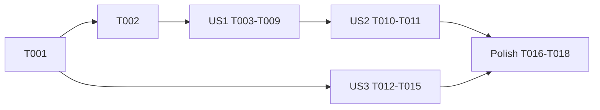

# Tasks: Personal Bests Tile Consistency & Desktop Row Alignment

**Input**: Design documents from `/specs/046-pb-tile-alignment/`

**Prerequisites**: [plan.md](plan.md), [spec.md](spec.md), [research.md](research.md), [data-model.md](data-model.md), [contracts/pb-grid-ui.md](contracts/pb-grid-ui.md), [quickstart.md](quickstart.md)

**Tests**: Contract-string assertions in `__tests__/index-script-syntax.test.js` are required. The existing profile-geometry assertions will otherwise fail (Constitution III).

## Format: `[ID] [P?] [Story] Description`

- **[P]**: Can run in parallel (different files, no dependencies)
- **[Story]**: US1 = desktop row grid, US2 = mobile unchanged, US3 = profile tile style

---

## Phase 1: Setup

- [X] T001 Run `npm test -- __tests__/index-script-syntax.test.js` from the repo root to record a green baseline before any change

---

## Phase 2: Foundational (blocking for US1/US2)

- [X] T002 Add the desktop placement rules to the existing `<style>` block in index.html, exactly as in contracts/pb-grid-ui.md §2: inside `@media (min-width: 1024px)`, `.pb-row-block .pb-grid-item { grid-row: var(--pb-row, 1); }` and `.pb-row-block [data-pb-col="1|2|3"] .pb-grid-item { grid-column: 1|2|3; }`

**Checkpoint**: The CSS exists but has no effect until the markup uses `pb-row-block`.

---

## Phase 3: User Story 1 – Sport cells of a block share rows on desktop (P1) — MVP

**Goal**: On screens ≥1024 px wide, the n-th Swim, Bike and Run tiles of the Distance records, Elevation and Longest blocks share one row (Swim left, Bike middle, Run right). The Watt block stays in the middle column.

**Independent Test**: quickstart.md scenario 1. At desktop width every block shows aligned rows, with no staircase.

### Tests for User Story 1

- [X] T003 [P] [US1] Add a test "lays out PB blocks as a strict desktop row grid" in __tests__/index-script-syntax.test.js. It asserts that `html` contains `pb-row-block` exactly 3 times, `data-pb-col="1"`, `data-pb-col="2"`, `data-pb-col="3"`, `lg:contents` and `lg:space-y-0`; that the PB markup no longer contains `lg:col-start-3 space-y-2` / `lg:col-start-1 space-y-2` for the row-grid wrappers; that `html` contains `grid-row: var(--pb-row, 1)`; and that `inlineCode` contains `function assignPbGridRows(` and `'--pb-row'`

### Implementation for User Story 1

- [X] T004 [US1] In index.html, update the Distance records block (wrappers of `pbRunContainer`, `pbBikeContainer`, `pbSwimContainer`):
  - add `pb-row-block` to the block grid div;
  - on the wrappers, replace `lg:col-start-3` / `lg:col-start-2` / `lg:col-start-1` with `data-pb-col="3"` / `"2"` / `"1"` and add `lg:contents`;
  - add `lg:space-y-0 lg:contents` to each container;
  - keep the DOM order Run → Bike → Swim, the `order-*` classes and the `lg:hidden` mobile headings.
- [X] T005 [US1] In index.html, apply the same changes as T004 to the Elevation block (`pbRunElevationContainer`, `pbBikeElevationContainer`, Swim "Not applicable for swimming." note). Add the class `pb-grid-item` to the Swim note `
` so it is placed in row 1, column 1.
- [X] T006 [US1] In index.html, apply the same changes as T004 to the Longest block (`pbRunLongestContainer`, `pbBikeLongestContainer`, `pbSwimLongestContainer`). Leave the Watt block (`pbBikePowerContainer` wrapper, `lg:col-start-2`) unchanged.
- [X] T007 [US1] In src/dashboard-power-pb.js, add `function assignPbGridRows(containerOrId)`. It resolves the element and, for each direct child at index i, adds the class `pb-grid-item` and calls `style.setProperty('--pb-row', String(i + 1))`. Place it near `appendPbDetailButton`.
- [X] T008 [US1] In src/dashboard-power-pb.js, call `assignPbGridRows(container)` at the end of each iteration of the per-sport `['Swim', 'Run', 'Bike'].forEach` loop (after tiles and any "No matching activities" note are appended). Also call it for each container after each of the five `renderRecordCard(...)` calls: `pbSwimLongestContainer`, `pbRunElevationContainer`, `pbBikeElevationContainer`, `pbRunLongestContainer`, `pbBikeLongestContainer`. Do NOT call it for `pbBikePowerContainer`.
- [X] T009 [US1] Run `npm test -- __tests__/index-script-syntax.test.js` and fix any failures from T003–T008

**Checkpoint**: The desktop layout is fixed; US1 can be validated alone.

---

## Phase 4: User Story 2 – Mobile layout unchanged (P1)

**Goal**: Below 1024 px, the order Run → Bike → Swim, the coloured sport labels, block headings and dividers look exactly as before.

**Independent Test**: quickstart.md scenario 2.

- [X] T010 [P] [US2] Extend the T003 test in __tests__/index-script-syntax.test.js to assert that `html` still contains `data-pb-mobile-sport="Run"`, `data-pb-mobile-sport="Bike"` and `data-pb-mobile-sport="Swim"` headings with `lg:hidden`, and the classes `order-1 lg:order-none`, `order-2 lg:order-none` and `order-3 lg:order-none`
- [X] T011 [US2] Check index.html by review: all placement CSS is inside the `min-width: 1024px` media query, and every `contents` class is `lg:`-prefixed (no bare `contents`), so mobile rendering is unaffected

**Checkpoint**: US1 and US2 together are the deliverable desktop and mobile layout fix.

---

## Phase 5: User Story 3 – All-time power profile matches other PB tiles (P2)

**Goal**: The profile tile uses the same card, chart proportions, text sizes, strokes, markers and footer as the other PB tiles. It has no "Power (W)" or "Duration" captions.

**Independent Test**: quickstart.md scenarios 3–4.

### Tests for User Story 3

- [X] T012 [P] [US3] In __tests__/index-script-syntax.test.js, update the test "renders the all-time power detail chart from duration categories, not activity dates":
  - remove the old in-tile geometry assertions: `const height = 148;`, `svg.setAttribute('class', 'block w-full max-w-none')`, `svg.setAttribute('height', String(height))`, `measurementLine.setAttribute('y2', height - bottom)`, `measurementLine.setAttribute('stroke-width', '3')`, `yLabel.setAttribute('y', '17')`, `const right = 24;` and `svg.style.aspectRatio = width + ' / ' + height`;
  - keep the detail-view, tooltip and hit-area assertions (`xAxisMode`, `profile-measurement-hit-area`, `'stroke-width': 24`, `showDurationProfileTooltip`, the `records: profilePoints.map(...)` string);
  - add assertions that `inlineCode` contains `profileSvg.setAttribute('viewBox', '0 0 ' + VB_W + ' ' + SVG_H)`, `profileBlock.className = 'bg-slate-950 border border-slate-800 rounded-xl p-3 space-y-1.5'`, `profilePoints.length + ' durations'` and `measurementLine.setAttribute('y2', X_AXIS_Y)`, and does not contain `xLabel.textContent = 'Duration'` or `yLabel.textContent = 'Power (W)'`.
- [X] T013 [US3] In __tests__/index-script-syntax.test.js, check the test "defines the dedicated Watt section and available-only profile contract": its `'Duration'` and `'Power (W)'` assertions must still pass through the detail view and axis-label code. Adjust them only if they fail after T014.

### Implementation for User Story 3

- [X] T014 [US3] In src/dashboard-power-pb.js, rewrite the profile tile SVG inside `renderBikePowerSection()` (the block starting `if (profilePoints.length >= 2) {`) per contracts/pb-grid-ui.md §4:
  - card `profileBlock.className = 'bg-slate-950 border border-slate-800 rounded-xl p-3 space-y-1.5'`;
  - rename the SVG variable to `profileSvg`, with `viewBox '0 0 ' + VB_W + ' ' + SVG_H`, `width 100%`, `preserveAspectRatio xMidYMid meet`, `style.display 'block'`, `style.overflow 'visible'` and no height attribute;
  - draw the axes with `appendTimelineAxes`-equivalent baseline and y-axis lines (`#1E293B`, stroke 1) at `PAD_L` / `X_AXIS_Y` / `CHART_TOP`, without year ticks;
  - x positions are evenly spaced duration categories between `PAD_L + 12` and `VB_W - PAD_R - 12`; y is `X_AXIS_Y - (watts / maxWatts) * (X_AXIS_Y - CHART_TOP - 2)`;
  - y labels via `appendYAxisLabel(profileSvg, …, Math.round(max) + ' W', true)` and `appendYAxisLabel(profileSvg, X_AXIS_Y - 1, '0 W', false)`;
  - polyline stroke `1.8`; measurement lines from the point to `X_AXIS_Y`, stroke `1.8`, opacity `0.75` (1 on hover); circles `r 2.5`;
  - duration labels only where `point.showLabel`, with font-size `8.5`, `ui-monospace, monospace`, fill `#CBD5E1`, y `SVG_H - 0.5`, text-anchor middle;
  - remove the "Power (W)" title and "Duration" caption texts and the `appendProfileWattLabel` helper;
  - keep the circle and line hit areas with class `profile-measurement-hit-area` and the `showPowerPbTooltip(e, point.record, 1, 1, color, point.durationLabel)` handlers;
  - append the footer `
` with text `profilePoints.length + ' durations'`.
- [X] T015 [US3] Run `npm test -- __tests__/index-script-syntax.test.js` and fix any failures from T012–T014

**Checkpoint**: The profile tile looks like the other tiles.

---

## Phase 6: Polish & Cross-Cutting

- [X] T016 Run the full root suite `npm test` and confirm it passes (SC-005)
- [X] T017 Run quickstart.md manual scenarios 1–5 at `http://localhost:8000`, including export of the Personal Bests tab and the profile tile detail, the sticky header alignment, and the breakpoint edge at 1024 px
- [X] T018 [P] Mark spec checklist items and completed tasks in specs/046-pb-tile-alignment/tasks.md

---

## Dependencies & Execution Order

- **Setup (T001)** → **Foundational (T002)** → US1 → US2 checks. US3 is independent of US1/US2 (different code region) and can start after T001.
- US1: T003 [P] can be written first. T004 → T005 → T006 (same file, sequential). T007 → T008 (same file). T009 last.
- US2: T010 builds on the T003 test. T011 is a review after T004–T006.
- US3: T012 → T013 (same test file, sequential); both can proceed in parallel with T014 (source file). T015 last.
- All edits to __tests__/index-script-syntax.test.js (T003, T010, T012, T013) run sequentially.
- Polish runs after all stories.

## Parallel Examples

- **US1**: Write T003 (test file) while T004–T006 (index.html) are in progress. T007/T008 (src/dashboard-power-pb.js) can run in parallel with the index.html edits.
- **US3**: T012 (test file) in parallel with T014 (src/dashboard-power-pb.js).
- **Across stories**: US3 source edits (T014, src/dashboard-power-pb.js profile block) in parallel with US1 index.html edits (T004–T006). Test-file edits stay sequential.

## Implementation Strategy

1. **MVP**: Phases 1–3 (desktop row grid). This is the most visible defect.
2. **Increment 2**: Phase 4 (mobile unchanged checks). Ship US1 + US2 together.
3. **Increment 3**: Phase 5 (profile tile style).
4. Finish with Phase 6 validation.
