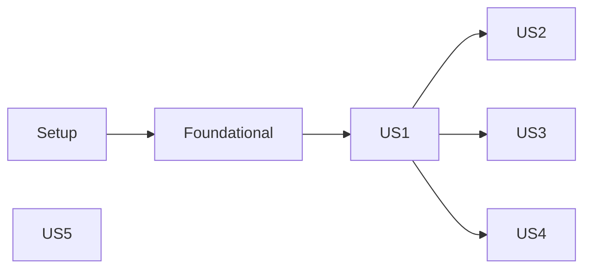

# Tasks: Pie Charts

**Input**: Design documents from `specs/049-pie-charts/`

**Prerequisites**: [plan.md](plan.md), [spec.md](spec.md), [research.md](research.md), [data-model.md](data-model.md), [contracts/](contracts/), [quickstart.md](quickstart.md)

**Tests**: Included. Constitution III requires focused tests for reusable modules, tab changes, and Share/Export of new visualization tabs.

**Organization**: Tasks are grouped by user story so each story can be implemented and tested on its own.

## Format: `[ID] [P?] [Story] Description`

- **[P]**: Can run in parallel (different files, no dependencies)
- **[Story]**: User story label (US1–US5)

---

## Phase 1: Setup

- [X] T001 Additively export `findBucketIndexForValue` in both the `module.exports` and `window.distributionUtils` bridges of src/distribution-utils.js (no signature change)
- [X] T002 Create src/pie-chart-utils.js skeleton: resolve `distributionUtils` via `require('./distribution-utils')` in Node and `window.distributionUtils` in the browser; define `PIE_DIMENSIONS = ['sport','duration','pace','equipment','length','power']`, `PIE_MEASURES = ['count','time','distance']`, `PIE_MAX_SLICES = 8`; export via `module.exports` and `window.pieChartUtils`
- [X] T003 Add `` directly after `./src/distribution-utils.js` in the head of index.html

---

## Phase 2: Foundational (blocking all stories)

- [X] T004 Register the tab in src/tab-navigation.js: append `'pieCharts'` to `TAB_ORDER` after `'wordcloud'`, add `pieCharts: 'vizTabPieCharts'` to `TAB_BUTTON_IDS` and `pieCharts: 'vizPanelPieCharts'` to `TAB_PANEL_IDS`
- [X] T005 Add tab button `#vizTabPieCharts` (label "Pie Charts", `role="tab"`, `aria-controls="vizPanelPieCharts"`, `onclick="setVisualizationTab('pieCharts')"`, `onkeydown="handleVisualizationTabKeydown(event, 'pieCharts')"`, same classes as `#vizTabWordcloud`) after the Wordcloud tab button, and an empty hidden panel `
` after `#vizPanelWordcloud` in index.html
- [X] T006 Create classic script src/dashboard-pie-charts.js exposing `window.pieChartsDashboard = { render }` and selection state `{ dimension: 'sport', measure: 'count', sport: 'All', colorScheme: 'fire' }` (session-only, not persisted); add `` after `./src/dashboard-wordcloud.js` and before `./src/dashboard-export.js` in index.html
- [X] T007 In src/dashboard-tabs.js add `else if (nextTab === 'pieCharts') { window.pieChartsDashboard.render(); }` to the render dispatch and `tabName === 'pieCharts' ? 'vizTabPieCharts' :` to the focus mapping
- [X] T008 [P] Update __tests__/tab-navigation.test.js to cover `pieCharts` in `TAB_ORDER`, button/panel IDs, activation, and keyboard wrap-around from `pieCharts` to `totalDistance`
- [X] T009 [P] Update __tests__/index-script-syntax.test.js to assert `pie-chart-utils.js` loads after `distribution-utils.js`, `dashboard-pie-charts.js` loads after `dashboard-wordcloud.js` and before `dashboard-export.js`, and that `#vizTabPieCharts`/`#vizPanelPieCharts` exist with matching ARIA attributes

**Checkpoint**: Empty Pie Charts tab is reachable via click and keyboard.

---

## Phase 3: User Story 1 – One large pie by dimension and measure (P1) 🎯 MVP

**Goal**: Large, polished pie grouped by Sport/Duration/Pace/Equipment/Length/Power and sized by Activities/Time/Distance, with legend, tooltip and summary.

**Independent Test**: Synthetic dataset → switch every dimension and measure; slice labels, values, counts and percentages match expected grouping (SC-001).

### Tests

- [X] T010 [P] [US1] Create __tests__/pie-chart-utils.test.js with synthetic activities covering: Sport dimension yields Run, Bike, Swim in that order and excludes `sport: null`; numeric dimensions ascending (underflow first, overflow last) with ≤ 8 slices; measures `count`/`time` (Σ `duration` s)/`distance` (Σ `distance` km) with non-positive time/distance contributing 0 and groups with `value <= 0` dropped; percentages sum to 100 ± rounding; `activityCount` and `excludedCount` correct; Equipment `''` → "No equipment", descending value, ties alphabetical, >8 groups → top 7 + "Other" (`isOther: true`, last); unknown dimension/measure or non-array input → empty result without throwing; a duration dataset spanning > 7 days still yields ≤ 8 slices
- [X] T011 [US1] Add tests in __tests__/pie-chart-utils.test.js for `formatPieMeasureValue`: `count` → "12 activities"/"1 activity", `time` → "45m"/"5h 20m", `distance` → "123.4 km"; plus a performance test: 5,000 synthetic activities, each dimension × measure combination via `computePieSlices` completes in < 1000 ms (SC-002)

### Implementation

- [X] T012 [US1] Implement `computePieSlices(activities, { dimension, measure, sport = 'All', colorScheme = 'fire', maxSlices = 8 })` in src/pie-chart-utils.js returning `{ slices, total, activityCount, excludedCount }`; slices `{ key, label, value, activityCount, percentage, color, isOther }`; numeric dimensions via `distributionUtils.computeDistributionBuckets(values, { metricKey, sport, targetBucketCount: 6 })` + `findBucketIndexForValue`; Pace with All Sports uses `getAllSportsPaceValue` labelled in km/h, single sport uses `getMetricValue`/`formatMetricValue`; Power uses `avgWatts`; Equipment grouping/“Other” per data-model rules 1–8; if a numeric dimension produces more than 8 non-empty buckets, retry `computeDistributionBuckets` with decreasing `targetBucketCount` until ≤ 8
- [X] T013 [US1] Implement `formatPieMeasureValue(measure, value)` in src/pie-chart-utils.js
- [X] T014 [US1] Add panel content to `#vizPanelPieCharts` in index.html: header "Pie Charts" with subtitle; Dimension button group (`pieDimensionBtnSport`, `pieDimensionBtnDuration`, `pieDimensionBtnPace`, `pieDimensionBtnEquipment`, `pieDimensionBtnLength`, `pieDimensionBtnPower` → `setPieDimension(key)`); Measure group (`pieMeasureBtnCount` "Activities", `pieMeasureBtnTime` "Time", `pieMeasureBtnDistance` "Distance" → `setPieMeasure(key)`); `#pieChartsCaptureArea` containing `#pieChartsSummary`, centered `<canvas id="pieChartsCanvas" role="img">` (~420 px mobile, ~520 px desktop) and `<ul id="pieChartsLegend">` beside the chart on `lg` and below on narrow viewports, no horizontal overflow; `#pieChartsEmptyState` (`role="status"`, hidden by default)
- [X] T015 [US1] Implement rendering in src/dashboard-pie-charts.js: compute slices from `processedActivities`, create/destroy a Chart.js `type: 'pie'` instance with 2 px slate-900 slice borders and `hoverOffset`, tooltip showing label, value (via `formatPieMeasureValue`), activity count and percentage, inline plugin drawing percentage labels for slices ≥ 5 %, HTML legend entries (swatch, label, value, percentage), summary text "<total> · <n> activities" plus "<k> activities without data" when `excludedCount > 0`, and `aria-label` describing the pie
- [X] T016 [US1] Implement global handlers `setPieDimension(key)` and `setPieMeasure(key)` in src/dashboard-pie-charts.js that update state, toggle the shared active/inactive button classes from src/tab-navigation.js, and re-render

**Checkpoint**: MVP – pie with dimension and measure switching works for All Sports.

---

## Phase 4: User Story 2 – Sport filter (P1)

**Goal**: Restrict the pie to All Sports, Run, Bike or Swim, with clear empty states.

**Independent Test**: Mixed-sport dataset → each filter counts only matching activities; Swim + Power shows empty state; Sport dimension + Run shows a single 100 % slice.

- [X] T017 [US2] Add tests in __tests__/pie-chart-utils.test.js for sport filtering (Run/Bike/Swim/All), single-sport pace units (min/km, km/h, min/100m), All-Sports pace in km/h, Swim + Power → empty result, Sport dimension + single sport → one slice at 100 %
- [X] T018 [US2] Add Sport button group (`pieSportBtnAll` "All Sports", `pieSportBtnRun`, `pieSportBtnBike`, `pieSportBtnSwim` → `setPieSportFilter(sport)`) to the controls in index.html
- [X] T019 [US2] Implement `setPieSportFilter(sport)` and empty-state handling in src/dashboard-pie-charts.js: when `slices.length === 0` show `#pieChartsEmptyState` ("No data available for this combination."), hide canvas/legend/summary and destroy the chart; otherwise hide the empty state

**Checkpoint**: US1 + US2 fully functional.

---

## Phase 5: User Story 3 – Colour scheme (P2)

**Goal**: Switch between "On fire" and "Monochrome blue" with distinguishable slices.

**Independent Test**: Toggle scheme → all slices/legend recolored, data and order unchanged, scheme kept across filter changes.

- [X] T020 [US3] Add tests in __tests__/pie-chart-utils.test.js for `getPieSliceColors(count, scheme)`: returns `count` distinct hex colors, `count === 1` → gradient middle, `'fire'` samples `getFireGradientColor`, `'monochrome-blue'` samples #BFDBFE → #3B82F6 → #1E3A8A, and "Other" slice uses #64748B
- [X] T021 [US3] Implement `getPieSliceColors(count, scheme)` and the blue gradient in src/pie-chart-utils.js; apply colors inside `computePieSlices` (non-Other slices sampled evenly, "Other" = #64748B)
- [X] T022 [US3] Add `<select id="pieChartsColorScheme" onchange="setPieColorScheme(this.value)">` with options `fire` "On fire" (selected) and `monochrome-blue` "Monochrome blue" in index.html, and implement `setPieColorScheme(scheme)` in src/dashboard-pie-charts.js (keeps scheme across other changes)

---

## Phase 6: User Story 4 – Export (P2)

**Goal**: Share the current pie via the existing local preview/download flow.

**Independent Test**: With data → preview shows chart, legend, summary and selection context; empty combination → standard no-data toast.

- [X] T023 [US4] Add the "Export for Insta / Strava" button (`onclick="exportVisualizationTab('pieCharts')"`, `aria-label="Export for Insta / Strava: Pie Charts"`, Instagram logo, same markup/classes as the Wordcloud export button) to the Pie Charts header in index.html
- [X] T024 [US4] Register `pieCharts` in src/dashboard-export.js: `EXPORT_CAPTURE_TARGET_IDS.pieCharts = 'pieChartsCaptureArea'`; `getExportableFlags().pieCharts = isEmptyStateHidden('pieChartsEmptyState')`; add `'vizTabPieCharts'` to `viewIds`; add control groups and export context for Dimension, Measure, Sport (button IDs from T014/T018) and Colour scheme (selected option text of `#pieChartsColorScheme`)
- [X] T025 [P] [US4] Create __tests__/pie-charts-dashboard.test.js (source-text assertions, node env) asserting: the export button calls `exportVisualizationTab('pieCharts')`; `#pieChartsCaptureArea` contains `#pieChartsCanvas` and `#pieChartsLegend`; src/dashboard-export.js maps `pieCharts` to `'pieChartsCaptureArea'`, sets the exportable flag via `isEmptyStateHidden('pieChartsEmptyState')`, and lists `'vizTabPieCharts'` in view IDs; src/dashboard-pie-charts.js removes `hidden` from `#pieChartsEmptyState` when `slices.length === 0` and adds it otherwise

---

## Phase 7: User Story 5 – Landing page bullet (P3)

**Goal**: "Pie charts" listed in the "And much more" tile.

**Independent Test**: Landing page tile shows "Pie charts" before "…", existing bullets kept.

- [X] T026 [US5] Insert `<li>Pie charts</li>` directly before `<li>…</li>` in `#andMuchMoreTile` in index.html
- [X] T027 [P] [US5] Extend __tests__/preview-assets.test.js to assert `#andMuchMoreTile` contains "Wordcloud", "Calendar view", "Pie charts" and that "Pie charts" precedes "…"

---

## Phase 8: Polish & Cross-Cutting

- [X] T028 Run `npx jest __tests__/pie-chart-utils.test.js __tests__/pie-charts-dashboard.test.js __tests__/tab-navigation.test.js __tests__/index-script-syntax.test.js __tests__/preview-assets.test.js`, then `npm test`; fix failures
- [ ] T029 Perform manual validation steps 1–10 from specs/049-pie-charts/quickstart.md (incl. narrow viewport, no new network requests, 1 s update target with large dataset)
- [X] T030 [P] Add a short Pie Charts entry to the visualization list in README.md

---

## Dependencies & Execution Order

- Phase 1 → Phase 2 → stories.
- US1 (Phase 3) is the base for US2–US4 (they extend the same panel and utility).
- US2, US3 depend on US1; they are independent of each other.
- US4 depends on US1 (capture area) and benefits from US2/US3 for context entries.
- US5 is independent of all other stories (only needs nothing beyond index.html) and can be done any time.
- Polish after all desired stories.

## Parallel Examples

- Phase 2: T008 and T009 in parallel after T004–T007.
- US1: T010/T011 (same test file, sequential) in parallel with T014 markup.
- After US1: US2 (T017–T019) and US3 (T020–T022) in parallel by different people; US5 (T026–T027) at any time.

## Implementation Strategy

1. **MVP**: Phases 1–3 (US1) → working pie with dimension/measure for All Sports.
2. Add US2 (sport filter + empty states) → complete P1 scope.
3. Add US3 (colour scheme) and US4 (export, required by constitution before release).
4. Add US5 (landing bullet), then Polish.
